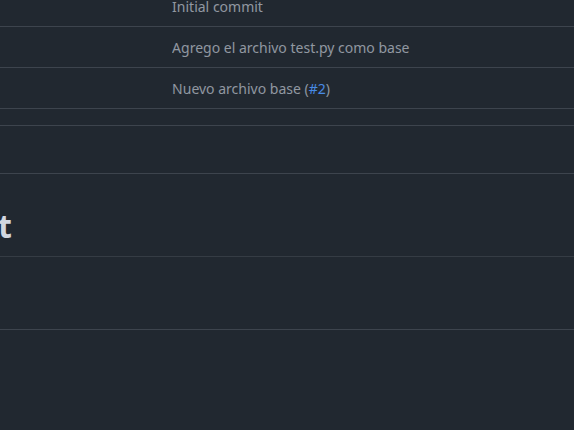

# Repositorio de pruebas

Este un repositorio hecho en la clase del 25/09/2025 para explicar git y github a los alumnos.

## Integrantes del grupo

## Arquitectura del Proyecto

El proyecto consta una aplicación escrita en Flask que utilizada "inserte una librería de mapas", que te permite trazar una ruta y colcar postas de hidratación mediante pines.

## Dependencias

Bueno, se necesita python >= 3.10.
Una API_KEY del servicio que estamos utilizando para mostrar el mapa.
Una API_KEY del servicio de mails que estamos utilizando
Bueno, se necesita instalar el entorno virtual de python, pyvenv, venv o poetry.

## Como levantar el proyecto

- Configurar las API_KEY, ya sea en un archivo .env o en la sesión de la consola
- Ejecutar el script `levantar_projecto.sh`, no olvidarse de darle permisos de ejecución.


## Features / Funcionalidades
## Funcionamiento / Tutorial

```python
def main()
    print(2+2)
main()
```

## Agregar una imagen


## Agregar una URL
[nombre_url](www.google.com)


## READMES
- [OTRO README](test/README.md)